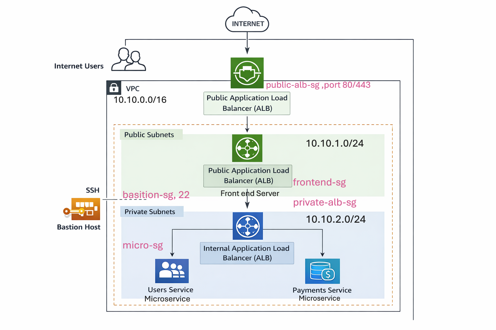

# AWS Enterprise Microservices Architecture (ALB + Internal ALB + Bastion)

## Architecture Diagram

## Project Overview

This project demonstrates a **production-style AWS architecture** where internet users access a web application through a public load balancer while backend microservices remain isolated inside private subnets.

The architecture follows **enterprise security practices** such as:

* Public and private subnet separation
* Bastion host for secure SSH access
* Internal load balancer and public load balancer for microservice routing
* Microservice architecture using Python Flask APIs

This project is designed for:

* DevOps learning
* AWS architecture practice
* Network engineering practice

# AWS Services Used

| Service                   | Purpose                   |
| ------------------------- | ------------------------- |
| Amazon VPC                | Network isolation         |
| Public Subnets            | Internet facing resources |
| Private Subnets           | Secure backend services   |
| Application Load Balancer | HTTP routing              |
| Internal ALB              | Microservice routing      |
| EC2                       | Application servers       |
| Security Groups           | Firewall control          |
| Bastion Host              | Secure SSH access         |

Folder Structure
aws-enterprise-microservices-project
│
├── README.md
│
├── architecture
│   └── architecture-diagram.png
│
├── app
│   ├── frontend
│   │   └── app.py
│   │
│   ├── users-service
│   │   └── users.py
│   │
│   └── payments-service
│       └── payments.py
│
├── scripts
│   ├── install_python.sh
│
│
├── infrastructure
│   ├── vpc-design.md
│   ├── security-groups.md
│
└── diagrams
    

## Author

**Kalyan Jalli**

Cloud & DevOps Engineer  
Building real-world AWS architecture and automation projects.

GitHub: https://github.com/cloudopsjalli

License

This project is for educational purposes.

